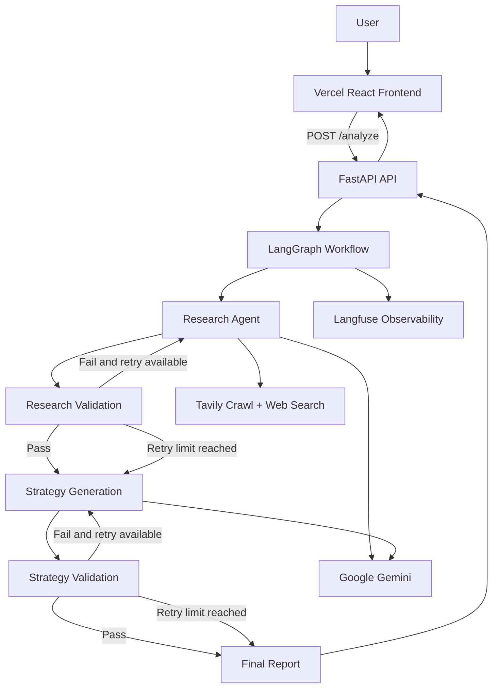

# BusinessIntel AI

AI-powered business research and strategy system that turns a company website and a business goal into a structured, evidence-backed business intelligence report.

## Live Application

- **Frontend:** https://frontend-pink-omega-62.vercel.app/
- **Backend API:** https://businessintel-ai.onrender.com
- **API documentation:** https://businessintel-ai.onrender.com/docs

## What It Does

BusinessIntel AI accepts:

1. A business website
2. A business goal

It then:

1. Researches the company using first-party website crawling and external web search.
2. Extracts a structured company profile.
3. Validates the research and supporting evidence.
4. Generates a business strategy.
5. Validates the strategy.
6. Builds a final report with sources and evidence.
7. Returns the result through a FastAPI API.
8. Renders the result in a React frontend.
9. Allows the user to download the report as Markdown.

## Architecture



See [ARCHITECTURE.md](./ARCHITECTURE.md) for the detailed workflow and component responsibilities.

## Core Workflow

The LangGraph workflow is:

```text
START
  ↓
research
  ↓
validate_research
  ├── valid → strategy
  ├── invalid + retry available → research
  └── retry limit reached → strategy
  ↓
strategy
  ↓
validate_strategy
  ├── valid → final_report
  ├── invalid + retry available → strategy
  └── retry limit reached → final_report
  ↓
final_report
  ↓
END
```

### Research

The research stage uses:

- Tavily website crawling for first-party information
- Tavily web search for external context
- Gemini through LangChain for structured company extraction

The resulting company profile contains:

- Company name
- Industry
- Description
- Offer
- Target audience
- Problem solved
- Business model
- Evidence

### Validation

Research validation checks for:

- Required company fields
- Minimum evidence
- Valid evidence URLs
- First-party evidence from the target website domain
- External evidence

Strategy validation checks that the generated strategy contains the required sections and that lead-generation and automation opportunities have supporting evidence.

### Strategy

The strategy layer produces:

- Marketing observations
- Lead-generation opportunities
- Automation opportunities
- Recommended actions

### Final Report

The final report combines the validated company profile and business strategy into a structured Markdown report.

The cloud API returns the report content directly, so the deployed application does not depend on persistent local report files.

## Tech Stack

### AI / Agent Layer

- Python
- LangChain
- LangGraph
- Google Gemini
- Tavily
- Pydantic structured outputs

### Backend

- FastAPI
- Uvicorn
- Langfuse
- In-memory LangGraph checkpointing

### Frontend

- React
- Vite
- JavaScript
- CSS

### Deployment

- Docker
- GitHub
- Render
- Vercel

## API

### GET /

Basic service information.

### GET /health

Health check endpoint.

Example response:

```json
{
  "status": "healthy"
}
```

### POST /analyze

Request:

```json
{
  "website": "https://www.hubspot.com/",
  "business_goal": "Analyze the business model and identify opportunities to improve lead generation and automation."
}
```

The response contains:

- `company_profile`
- `business_strategy`
- `report_markdown`

## Project Structure

```text
Business Stategist project/
│
├── frontend/
│   ├── src/
│   │   ├── App.jsx
│   │   └── index.css
│   ├── package.json
│   └── ...
│
├── agent.py
├── api.py
├── graph.py
├── report.py
├── research.py
├── strategy.py
├── validation.py
├── main.py
├── pipeline.py
├── website_research.py
│
├── Dockerfile
├── .dockerignore
├── .gitignore
├── pyproject.toml
├── uv.lock
└── README.md
```

## Local Backend Setup

Requirements:

- Python 3.13+
- uv
- Docker Desktop for container testing

Install dependencies:

```bash
uv sync
```

Set environment variables in a local `.env` file.

Run the API directly:

```bash
uv run uvicorn api:app --reload
```

Open:

```text
http://127.0.0.1:8000/docs
```

## Docker

Build the backend image:

```bash
docker build -t businessintel-ai .
```

Run it locally:

```bash
docker run --rm -p 10000:10000 --env-file .env businessintel-ai
```

Open:

```text
http://localhost:10000/docs
```

## Frontend Setup

From the frontend directory:

```bash
npm install
npm run dev
```

Create the frontend environment variable:

```env
VITE_API_URL=https://businessintel-ai.onrender.com
```

For local development, the Vite app runs on:

```text
http://localhost:5173
```

## Environment Variables

Backend:

```text
GOOGLE_API_KEY
TAVILY_API_KEY
LANGFUSE_PUBLIC_KEY
LANGFUSE_SECRET_KEY
LANGFUSE_BASE_URL
LANGFUSE_TRACING_ENVIRONMENT
```

Frontend:

```text
VITE_API_URL
```

Never commit the backend `.env` file or secret API keys to GitHub.

## Design Decisions

### Evidence-first research

The system does not rely only on generated text. Company claims are attached to source evidence and validated before the workflow proceeds.

### Validation as part of the workflow

Validation is implemented as explicit LangGraph nodes rather than being treated as a final manual step.

### Structured outputs

Pydantic models keep company research and strategy outputs predictable for downstream processing and the frontend.

### Separate frontend and backend

The React frontend is deployed separately from the FastAPI backend, allowing the API and UI to evolve independently.

### RAG is intentionally not part of this version

The current application uses live web research and structured evidence. Retrieval-Augmented Generation and vector databases are intentionally left for a separate project and learning stage.

## Observability

Langfuse is integrated into the workflow for LLM/application tracing.

The LangGraph workflow also includes lightweight middleware hooks around model execution for runtime visibility.

## Current Scope

This project is focused on:

- Web research
- Company intelligence
- Evidence validation
- Business strategy generation
- Strategy validation
- Report generation
- API delivery
- Production deployment

Future improvements can include:

- Authentication
- Persistent report storage
- Database-backed analysis history
- Background job processing
- Better report export formats
- Automated CI/CD checks
- More granular production monitoring

## Author

Built as a hands-on Agentic AI engineering project to practice:

- LangChain
- LangGraph
- Tool calling
- Structured outputs
- Validation
- API development
- Docker
- Cloud deployment
- Production debugging
